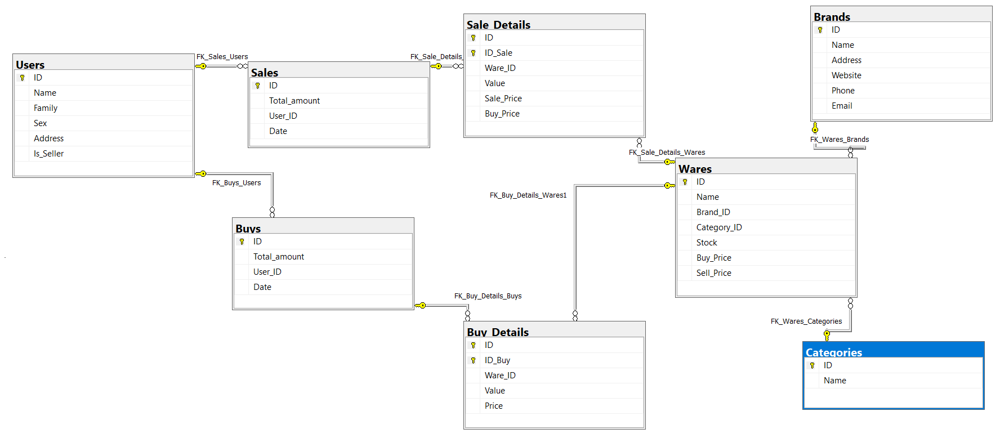
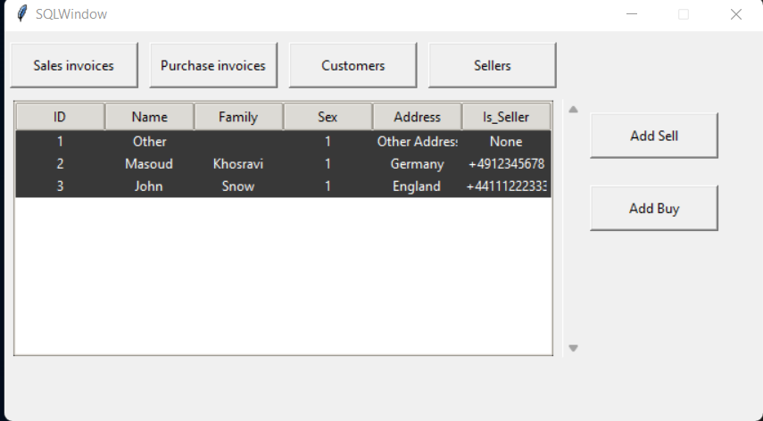
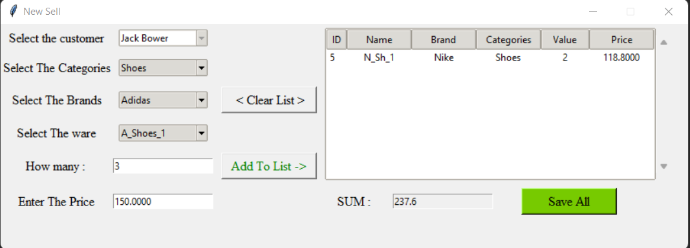

<div align="center">

# USE $\color{Yellow}SQLite$ Files in $\color{#1DADFF}Python$ 


  


# $\color{red}Hello \space \color{lightblue}and \space \color{orange}Wellcome$

</div>

### In This Project We Try to use some SQL structure in python
## For Example:
+ Connecting to SQLite
+ Creatung Table
+ Reading table's data
+ Reading data by views in sql
+ Storing data in sql tables
+ Using sql commands
+ And finaly We try to create one Graphical User Interface by tkinter
###  <  Note: This a very simple project to familiarize you more with this environment >
## OK, Let's go

### At First we create a database by this tables:
+ Users
+ Sells
+ Buys
+ Sell_details
+ Buy_details
+ Wares
+ Brands
+ Caegories

And we connect theme to each Other by foreign key as you see

<br/>

and Now We Create To example views to use later
## We create Some Procedure to add and view


## After creating the DataBase , we made a simple $\color{red}Graphical \space \color{#00E700}User \space \color{#00D4FF}Interface$ (GUI) by $\color{yellow}TKinter$
You can take a look at it :

<br/>



## In order to cover almost many cases, we used a different object and different type of functions in sql_commands in each part
## All comboboxes and other objects take items directly from the functions written in part sql_commands
<br/>
Let's take a look at some of them:

```python
import sqlite3

class DataBase:

    def __init__(self, db_name):
        self.db = db_name
        self._connect()
        self.__create_first()

    def _connect(self):
        self.conn = sqlite3.connect(self.db)
        self.cursor = self.conn.cursor()
        self._set_foreign_keys()    

# ======= Get All Customers  =======================
    def view_customers(self):
        self._connect()
        self.cursor.execute("SELECT ID, Name || ' ' || Family AS Customer FROM Users WHERE Is_Seller=0")
        rows = self.cursor.fetchall()
        self.conn.close()
        return rows
```

```python
# ======== Get All items From Sells Table And join With Users To Find Out Customers Name ============
    def view_sells(self):
        self._connect()
        query = "SELECT S.ID,S.Total_amount,U.Name || ' ' || U.Family As FullName ,S.Date FROM" \
                " Sells S INNER JOIN Users U ON S.User_ID = U.ID"
        self.cursor.execute(query)
        rows = self.cursor.fetchall()
        self.conn.close()
        return rows
```

## Here is an interesting point : we made a function To for buy
The function itself updates the buy price in the (Wares Table) bye calculating average price, then updates sell price With a twenty percent increase in the average purchase price
lets see it
```python
    def add_buy_details(self, id_buy, ware_id, value, price):
        self._connect()
        query = "SELECT Buy_Price,Stock FROM Wares WHERE ID={}".format(ware_id)
        self.cursor.execute(query)
        rows = self.cursor.fetchone()
        buy_old = rows[0]
        stock_old = rows[1]
        new_stock = value + stock_old
        new_buy = (buy_old * stock_old + price * value) / new_stock
        new_sell = new_buy * 120 / 100

        query1 = "INSERT INTO Buys_Details (ID_Buy,Ware_ID,Value,Price) VALUES ({},{},{},{})".format(id_buy, ware_id,
                                                                                                     value, price)
        query2 = "UPDATE Wares SET Stock={} , Buy_Price={}, Sell_Price={} WHERE ID={}".format(new_stock, new_buy,
                                                                                              new_sell, ware_id)
        scrip = query1 + "; " + query2 + ";"
        self.cursor.executescript(scrip)
        self.conn.commit()
        self.conn.close()
```


so easily :)

Thank you for reading this section<br/>


<br/>

## Other Repositories:
[](https://github.com/Masoud-Khosravi/SQL-Python)
[](https://github.com/Masoud-Khosravi/Tensorflow-Covid-19)

[](https://github.com/Masoud-Khosravi/Machine-Learning)
[](https://github.com/Masoud-Khosravi/Stock-Markets)

<br/>
<br/>
<div align="left">

## $\color{red}About \space \color{orange}Me:$
<a href="https://github.com/Masoud-Khosravi">
  
</a>
<br/>
<br/>

</div>
<p align="center">
  <br/>
  <a href="https://www.linkedin.com/in/masoudkhosravi/">
      
  </a>
  <a href="mailto:masoudkh.new@gmail.com">
      
  </a>
  <a href="https://github.com/Masoud-Khosravi">
     
  </a>
  <br/>
  <a href="https://github.com/Masoud-Khosravi">
       
  <!---  
      
  -->
    
  </a>
  
</p>
